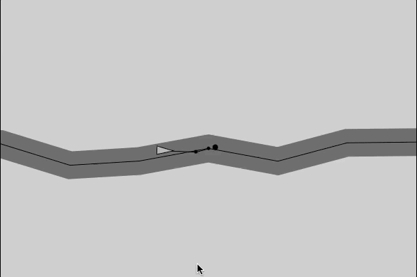

## Description
Creating a path following behavior as in [this](https://www.youtube.com/watch?v=2qGsBClh3hE) video by Daniel Shiffman. Converted his Java example into JavaScript.

## Link
You can see the version live on [Codepen](https://codepen.io/FlorinPop17/full/LdZjRb).

## Credits
- Daniel Shiffman - [The Coding Train](https://www.youtube.com/channel/UCvjgXvBlbQiydffZU7m1_aw)
- Nature of Code [book](http://natureofcode.com/book/)