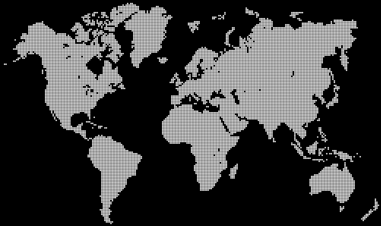

## Description
Using a world map image I got the pixel values and recreated a dotted version of the World Map using p5js. It is also possible to change the size of the dot using a slider.

## Link
You can see the version live on [Codepen](https://codepen.io/FlorinPop17/full/QmgEBe).

## Credits
- Image from [Freepik](https://www.freepik.com/free-vector/grey-world-map_893780.htm)