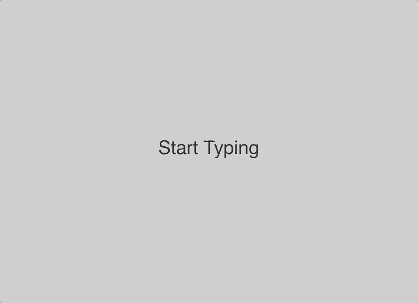

## Description
Press any keyboard key and a letter which has a random UP force will jump on the screen. A small gravitational force will then pull it back to the bottom of the screen where it will disappear.

## Link
You can see the version live on [Codepen](https://codepen.io/FlorinPop17/full/XEgpvM).

## Credits
- Inspired from [Two.js examples](https://two.js.org/examples/text.html)