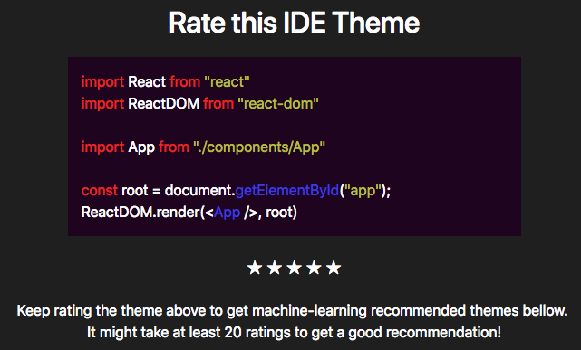

## Description
This application is using [brain.js](https://github.com/BrainJS)'s ML algorithms to recommend different IDE themes based on user preference. Inspired by [this](https://www.youtube.com/channel/UCVTlvUkGslCV_h-nSAId8Sw) youtube video.

## Done
- [x] Add link to Codepen
- [x] Add example image

## To do
- [ ] Save data to localstorage

## Link
Live on [Codepen](https://codepen.io/FlorinPop17/full/MVPGGy)

## Credits
- [brain.js](https://github.com/BrainJS)
- [LearnCode.academy Youtube Channel](https://www.youtube.com/channel/UCVTlvUkGslCV_h-nSAId8Sw)