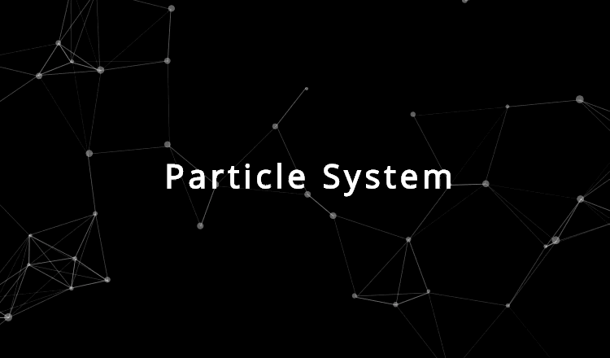

## Description
Crated a particle system in p5js similar to [this](https://vincentgarreau.com/particles.js/) demo.

## Done
- [x] Improved speed of distance calculation by changing the two loops from ```n * n``` to ```(n * (n - 1)) / 2``` checks.
- [x] Add link to Codepen
- [x] Add gif example

## Link
Live on [Codepen](https://codepen.io/FlorinPop17/full/geBzZE)

## Credits
- [Particles.js](https://vincentgarreau.com/particles.js/)