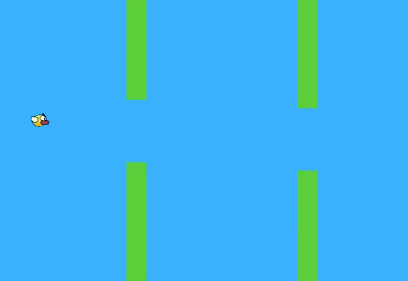

## Description
Flappy bird - the bird is learning to fly between the pipes by using Machine Learning and Genetic Algorithm to train it.

## Link
You can see the version live on [Codepen](https://codepen.io/FlorinPop17/full/OZXrJG)

## Done
- [x] create Bird
- [x] create Pipes
- [x] add physics to Bird
- [x] add collision to Bird with the Pipes
- [x] allow the Bird to jump
- [x] reset game when the Bird collided with a Pipe
- [x] keep track of the score
- [x] keep track of the highest score
- [x] add Neural Network (aka a brain) to the Bird
- [x] train the Bird
- [x] create a population of Birds
- [x] add Genetic Algorithm to the Birds
- [x] create a slider to be able to control how fast the NN will learn
- [x] add bird "death" when hits the floor or ceiling
- [x] add text outside the canvas or make it visible
- [x] add nice graphics to the game

## To do
- [ ] switch to Brain.js for NN
- [ ] add gif example

## Credits
- [FontAwesome v4](https://fontawesome.com/)
- Built with [p5js](https://p5js.org)
- Inspired from [TheCodingTrain](https://www.youtube.com/channel/UCvjgXvBlbQiydffZU7m1_aw)
- Also the matrix & nn libraries from [TheCodingTrain](https://www.youtube.com/channel/UCvjgXvBlbQiydffZU7m1_aw)
