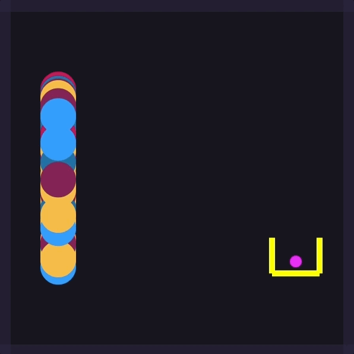

## Description
Generating random balls which will learn how to set the appropiate force needed to get into the hoop.

## Link
You can see the version live on [Codepen](https://codepen.io/FlorinPop17/full/xjPELJ)

## Done
- [x] create Ball
- [x] add physics to the Ball
- [x] add friction, gravity & drag force to the Ball
- [x] allow user to shot the Ball
- [x] draw line from the Ball to where the mouse position before the shot
- [x] see the ball rotation
- [x] create hoop
- [x] increase score when the ball goes in the hoop
- [x] add nn
- [x] create generations of balls
- [x] add slider for faster learning
- [x] change it to work with Matter.js for better physics engine

## To do
- [ ] improve fitness function

## Credits
- [FontAwesome v4](https://fontawesome.com/)
- Physics built with [Matter.js](http://brm.io/matter-js/)
- Matrix & NN libraries from [TheCodingTrain](https://www.youtube.com/channel/UCvjgXvBlbQiydffZU7m1_aw)