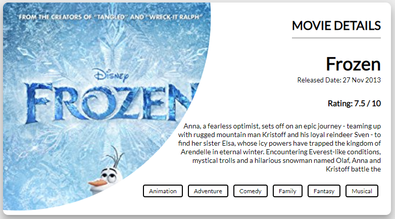

## Description

Movie Search App - search your favorite movie.

## Done

-   [x] Add react project in Codepen
-   [x] Find and use an API for movies
-   [x] Find a design
-   [x] Create a movie template design
-   [x] increase tags container width, same as you did for the plot
-   [x] Create a movie list
-   [x] Add search field
-   [x] Add submit handle on button

## Link

You can see the version live on [Codepen](https://codepen.io/FlorinPop17/full/rRaEYv) and also you can read how I built it in this [article](https://www.florin-pop.com/blog/2019/02/react-movie-search-app/).

## Credits

-   Built with React
-   Design inspired from [Dribbble](https://dribbble.com/shots/6028615-Spider-man-Movie)
-   API from [The Open Movie Database](http://www.omdbapi.com/)
-   Icons from [FontAwesome](https://fontawesome.com/?from=io)
-   Axios for making API calls
