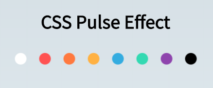

## Description

Pulse Effect on blobs with CSS Animations.

## Link

You can see the version live on [Codepen](https://codepen.io/FlorinPop17/full/drJJzK) and also you can read how I built it in this [article](https://www.florin-pop.com/blog/2019/03/css-pulse-effect/).

## Credits

-   Icons from [FontAwesome](https://fontawesome.com/?from=io)
